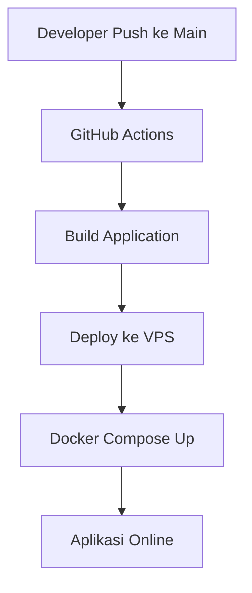

# 🐍 Wikipedia Ular - UAS Sentul

Website informasi ular berbasis **Node.js**, **Express**, dan **EJS** yang dijalankan menggunakan **Docker**, dideploy otomatis menggunakan **GitHub Actions**, diamankan dengan **HTTPS Let's Encrypt**, serta dimonitor menggunakan **Uptime Kuma**.

---

# 📋 Project Overview

Project ini dibuat untuk memenuhi tugas **UAS Sistem Operasi dan Jaringan Komputer** STMIK Tazkia Semester Genap 2025/2026.

## Fitur

- Halaman informasi ular berbasis Wikipedia
- Reverse Proxy menggunakan Nginx
- HTTPS menggunakan Let's Encrypt
- Containerization menggunakan Docker
- CI/CD otomatis menggunakan GitHub Actions
- Monitoring menggunakan Uptime Kuma
- Backup otomatis harian menggunakan Cron

---

# 🌐 Informasi Domain

| Komponen | Nilai |
|-----------|---------|
| Website Utama | https://roesdi.my.id |
| Monitoring | https://monitor.roesdi.my.id |
| IP VPS | 103.168.146.195 |
| Repository | https://github.com/r18211949/uas-sentul |

---

# 🏗️ Arsitektur Sistem

```text
Internet
    │
    ▼
DNS (roesdi.my.id)
    │
    ▼
Nginx Reverse Proxy
(SSL Let's Encrypt)
    │
    ▼
Docker Container
(Node.js + Express)
Port Internal : 3000
Port Host     : 8081

    │
    ▼

Uptime Kuma
Port : 3002
monitor.roesdi.my.id
```

---

# 🔧 Infrastruktur

| Komponen | Detail |
|-----------|----------|
| Web Server | Nginx |
| Backend | Node.js + Express |
| Template Engine | EJS |
| Containerization | Docker & Docker Compose |
| SSL/TLS | Let's Encrypt |
| CI/CD | GitHub Actions |
| Monitoring | Uptime Kuma |
| Backup | Cron Job |

---

# 📂 Struktur Deployment

```text
/home/m1821/
│
├── my-app/
│   ├── Dockerfile
│   ├── docker-compose.yml
│   ├── package.json
│   ├── app.js
│   ├── views/
│   └── .github/
│       └── workflows/
│           └── deploy.yml
│
├── backups/
│   ├── app-20260622-134907.tar.gz
│   └── backup.log
│
└── backup.sh
```

---

# 🚀 Deployment Otomatis (CI/CD)

Setiap perubahan yang di-push ke branch `main` akan secara otomatis dideploy ke VPS menggunakan GitHub Actions.

## Alur CI/CD



## Tahapan Deployment

1. Developer melakukan perubahan kode.
2. Perubahan di-push ke branch `main`.
3. GitHub Actions menjalankan workflow deployment.
4. VPS mengambil perubahan terbaru dari repository.
5. Docker Compose melakukan build ulang container.
6. Container aplikasi direstart.
7. Aplikasi versi terbaru langsung tersedia.

### Workflow CI/CD

```bash
.github/workflows/deploy.yml
```

---

# ▶️ Cara Menjalankan Aplikasi

## Clone Repository

```bash
git clone https://github.com/r18211949/uas-sentul.git /home/m1821/my-app

cd /home/m1821/my-app
```

## Build dan Jalankan

```bash
docker compose up -d --build
```

## Verifikasi

```bash
curl http://localhost:8081
```

## Cek Status Container

```bash
docker ps
```

---

# 🔄 Restart Aplikasi

Jika aplikasi mengalami kendala atau setelah melakukan perubahan konfigurasi:

```bash
cd /home/m1821/my-app

docker compose restart
```

Verifikasi:

```bash
docker ps
```

---

# ⏪ Rollback Versi Sebelumnya

Rollback digunakan apabila deployment terbaru mengalami masalah.

## Melihat Riwayat Commit

```bash
git log --oneline
```

Contoh:

```text
a1b2c3d Fix navbar bug
d4e5f6g Update UI
```

## Revert Commit

```bash
git revert <commit-hash> --no-edit
```

Contoh:

```bash
git revert a1b2c3d --no-edit
```

## Push Perubahan

```bash
git push origin main
```

CI/CD akan otomatis melakukan deployment ulang.

---

# 💾 Backup Otomatis

Backup aplikasi dilakukan setiap hari pukul **02:00 WIB**.

## Cron Job

```cron
0 2 * * * /home/m1821/backup.sh
```

## Lokasi Backup

```bash
/home/m1821/backups/
```

Contoh file backup:

```text
app-20260622-134907.tar.gz
```

---

# ♻️ Restore dari Backup

## 1. Melihat Daftar Backup

```bash
ls -lah /home/m1821/backups/
```

Contoh:

```text
app-20260620-020000.tar.gz
app-20260621-020000.tar.gz
app-20260622-134907.tar.gz
```

## 2. Ekstrak Backup

```bash
sudo tar -xzf /home/m1821/backups/app-YYYYMMDD-HHMMSS.tar.gz -C /tmp/
```

## 3. Salin Hasil Restore

```bash
sudo cp -r /tmp/home/m1821/my-app/* /home/m1821/my-app/
```

## 4. Restart Aplikasi

```bash
cd /home/m1821/my-app

docker compose restart
```

## Contoh Restore Lengkap

```bash
sudo tar -xzf /home/m1821/backups/app-20260622-134907.tar.gz -C /tmp/

sudo cp -r /tmp/home/m1821/my-app/* /home/m1821/my-app/

cd /home/m1821/my-app

docker compose restart
```

## Verifikasi Setelah Restore

```bash
docker ps
```

```bash
curl http://localhost:8081
```

Jika container berstatus **Up** dan aplikasi memberikan respons normal, maka proses restore berhasil.

---

# 📊 Monitoring

Monitoring dilakukan menggunakan **Uptime Kuma**.

## Dashboard

```text
https://monitor.roesdi.my.id
```

## Target Monitor

```text
https://roesdi.my.id
```

## Konfigurasi

| Parameter | Nilai |
|------------|---------|
| Tipe Monitor | HTTP/HTTPS |
| Interval | 60 Detik |
| Status UP | Hijau |
| Status DOWN | Merah |

---

# 📝 Logging

## Log Aplikasi

```bash
docker logs my-app-app-1
```

Realtime:

```bash
docker logs -f my-app-app-1
```

Berdasarkan waktu:

```bash
docker logs --since 2026-06-22T14:00:00 my-app-app-1
```

---

## Log Nginx

### Access Log

```bash
sudo tail -f /var/log/nginx/access.log
```

### Error Log

```bash
sudo tail -f /var/log/nginx/error.log
```

---

## Log Backup

```bash
cat /home/m1821/backups/backup.log
```

---

# ⚙️ Informasi Operasional

| Item | Lokasi |
|---------|---------|
| Folder Project | /home/m1821/my-app |
| Folder Backup | /home/m1821/backups |
| Script Backup | /home/m1821/backup.sh |
| Konfigurasi Nginx | /etc/nginx/sites-available/roesdi.my.id |
| Workflow CI/CD | .github/workflows/deploy.yml |
| Port Aplikasi | 8081 |
| Port Monitoring | 3002 |

---

# 🛠️ Teknologi yang Digunakan

- Node.js
- Express.js
- EJS
- Docker
- Docker Compose
- Nginx
- Let's Encrypt (Certbot)
- GitHub Actions
- Uptime Kuma
- Cron

---

# 👨‍🎓 Informasi Akademik

**Mata Kuliah:** Sistem Operasi dan Jaringan Komputer  
**Program Studi:** Teknik Informatika  
**Institusi:** STMIK Tazkia  
**Semester:** Genap 2025/2026

---

# 📄 Lisensi

Dokumentasi ini dibuat untuk keperluan akademik dalam rangka memenuhi tugas UAS Sistem Operasi dan Jaringan Komputer STMIK Tazkia.
